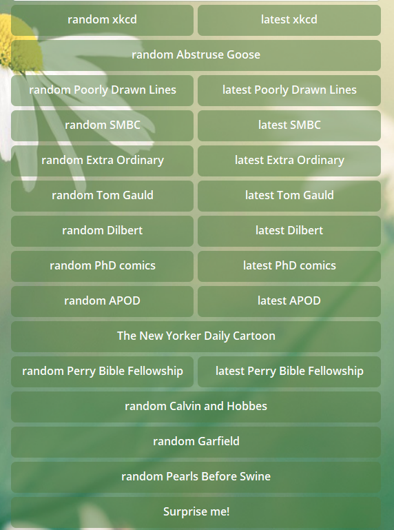

# ComicsBot

ComicsBot can currently entertain you with 13 different web-comics 
(xkcd, SMBC, Abstruse Goose, Extra Ordinary, Poorly Drawn Lines, 
Dilbert, PhD comics, Tom Gauld's, Perry Bible Fellowship, Calvin and Hobbes, Garfield, Pearls Before Swine,
and The New Yorker Daily Cartoon) and with NASA's Astronomy Picture of the Day.
It can show you the latest comic or a random one.
Type "start" to see the options.

You can also subscribe for updates, that would be checked daily at 13:37.
Type "subscribe" for that.

That's all, folks :)
